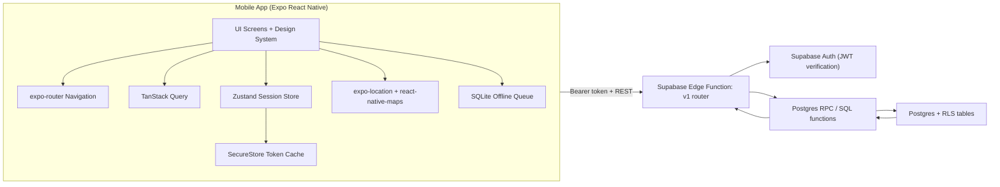
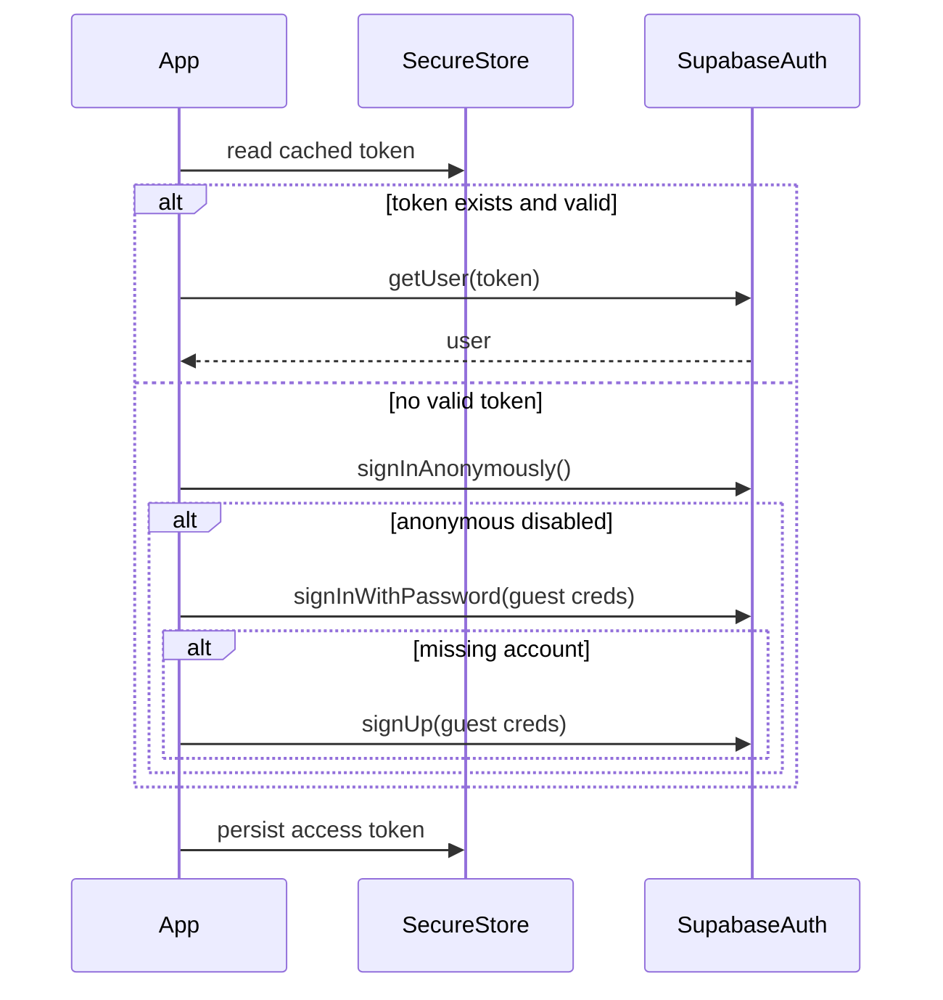
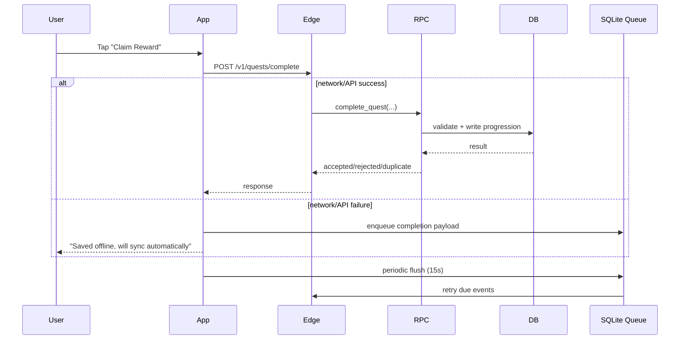

# Passport Quest Architecture (Living Document)

Last updated: February 21, 2026  
Scope: India-first MVP v1 + v1.1 backend foundation (Bangalore production, Delhi/Pune post-gate)

## 1. Architecture goals

- Keep gameplay trust server-side.
- Keep client resilient to flaky/mobile networks.
- Keep APIs and schema additive in MVP.
- Keep city behavior configurable without app redeploy.

## 2. High-level system design

## 3. Repository mapping

- `/Users/atulkrishnan/Documents/Passport Quest/apps/mobile`: Mobile app, UI, state, API client, offline queue.
- `/Users/atulkrishnan/Documents/Passport Quest/packages/shared`: Shared API contracts/types.
- `/Users/atulkrishnan/Documents/Passport Quest/supabase/functions/v1`: Edge API router.
- `/Users/atulkrishnan/Documents/Passport Quest/supabase/migrations`: Schema, RLS, RPCs, seed data.
- `/Users/atulkrishnan/Documents/Passport Quest/docs`: Architecture + product/rollout docs.

## 4. Mobile architecture

### 4.1 Presentation and navigation

- `expo-router` route tree with 4 tabs:
- `Map` (`app/(tabs)/index.tsx`)
- `Quests` (`app/(tabs)/quests.tsx`)
- `Social` (`app/(tabs)/social.tsx`)
- `Profile` (`app/(tabs)/profile.tsx`)
- Quest detail route:
- `app/quest/[questId].tsx`
- App-facing city UX is fixed to Bangalore (`blr`) for MVP pilot validation.

### 4.2 UI system

- Theme tokens in `src/theme`:
- Color, spacing, typography, radius, elevation, motion tokens.
- Reusable components in `src/ui/components`:
- `ScreenContainer`, `TopBar`, `GlassCard`, `NeonButton`, `XPBar`, `QuestMiniCard`, etc.

### 4.3 State and data

- `Zustand` session store for token/user/city state.
- `TanStack Query` for server reads and invalidation after writes.
- Offline write queue in SQLite (`offline_events`) with exponential backoff retries.

## 5. Backend architecture

### 5.1 Edge API routes (current)

- `GET /v1/quests/nearby`
- `POST /v1/quests/complete`
- `GET /v1/social/feed`
- `POST /v1/social/friends/request`
- `POST /v1/social/friends/request-by-username`
- `POST /v1/social/friends/accept`
- `GET /v1/social/friend-requests/incoming`
- `GET /v1/users/me/profile-compare`
- `GET /v1/config/bootstrap`
- `GET /v1/users/me/summary` (additive read endpoint)
- `GET /v1/users/me/badges` (additive read endpoint)
- `PATCH /v1/users/me/profile` (additive profile mutation endpoint)
- `POST /v1/notifications/register-token` (additive push registration endpoint)
- `POST /v1/trips/context/start` (v1.1 additive)
- `PATCH /v1/trips/context/{tripContextId}` (v1.1 additive)
- `POST /v1/trips/context/{tripContextId}/end` (v1.1 additive)
- `GET /v1/quests/recommended` (v1.1 additive)
- `POST /v1/recommendations/feedback` (v1.1 additive)

### 5.2 Core RPC / server logic

- `get_nearby_quests`: city-aware geofence query.
- `complete_quest`: anti-cheat + idempotency + XP/level/streak + badge unlock in trusted transaction.
- `request_friend` and `accept_friend_request`: async social graph mutation.
- `request_friend_by_username` and `get_incoming_friend_requests`: username-first social UX.
- `get_social_feed`: feed pagination.
- `profile_compare`: friend-scoped compare response.
- `get_bootstrap_config`: city runtime config payload.
- `assign_experiment_variant`: deterministic holdout assignment persisted per user.
- `upsert_user_push_token`: push token storage for nudge delivery.
- `start_trip_context`, `update_trip_context`, `end_trip_context`: trip-intent session lifecycle.
- `get_recommended_quests`: rule-based quest ranking using city/activity + context tags + freshness.
- `record_recommendation_feedback`: feedback signal capture for recommendation quality loop.

### 5.3 Security model

- JWT required on all v1 routes.
- RLS enabled across gameplay/social tables.
- Sensitive mutations restricted to server function path.
- Idempotency uniqueness: `(user_id, device_event_id)` in `quest_completions`.

## 6. Data model domains

### City/config

- `cities`
- `city_runtime_config`

### Identity/progression

- `profiles`
- `user_stats`
- `badges`
- `user_badges`

### Gameplay

- `quests`
- `quest_completions`

### Social

- `friend_requests`
- `friendships`
- `activity_feed_events`

### Notifications/experiments

- `user_push_tokens`
- `user_experiments`

### Recommendation/trip context (v1.1 foundation)

- `user_preferences`
- `trip_context_sessions`
- `quest_experience_tags`
- `recommendation_feedback`

### Security telemetry

- `security_events`

## 7. Key runtime flows

### 7.1 Guest bootstrap flow

### 7.2 Quest completion (online/offline)

### 7.3 Social flow

1. Send friend request by username (`/social/friends/request-by-username`).
2. Receiver accepts from incoming pending list (`/social/friends/accept` + `/social/friend-requests/incoming`).
3. Feed events become visible through `/social/feed`.
4. Profile compare uses friend-only scope (`/users/me/profile-compare`).

### 7.4 Trip context and recommendations (v1.1 foundation)

1. Start a context (`/trips/context/start`) with outing intent (`solo/couple/family/friends`) and constraints.
2. Mid-outing update is partial (`/trips/context/{tripContextId}`), preserving untouched values.
3. Recommendations query (`/quests/recommended`) ranks active city quests by:
- distance proxy (recent accepted location when available),
- context-tag match (`family_safe`, `date_friendly`, etc.),
- freshness score.
4. End context (`/trips/context/{tripContextId}/end`) transitions active session to `completed` or `cancelled`.
5. Interaction feedback (`/recommendations/feedback`) is stored for future ranker tuning.

## 8. Reliability and performance seams

- Offline queue durability across app restarts (SQLite).
- Server idempotency guarantee on quest completion.
- Anti-cheat thresholds loaded from `city_runtime_config`.
- City-specific behavior controlled by runtime config and feature flags.

## 9. Evolution policy (important)

### 9.1 API and schema

- v1 API is additive-only during MVP:
- Allowed: new fields, new endpoints.
- Not allowed: field removals/renames, behavior-breaking changes.
- DB changes via additive migrations only.

### 9.2 City expansion

- Rollout order: `blr -> del -> pune -> international`.
- Keep Bangalore as default live pilot (`cityId=blr`).
- Keep Delhi (`del`) and Pune (`pune`) as post-gate rollout cities.
- Keep NYC in backend staging/content-prep path only (not exposed in app UI).
- Use `city_runtime_config` for anti-cheat, quiet hours, and feature flags.

### 9.3 Change governance

- For any non-trivial architecture change:
- Add a short ADR in `/Users/atulkrishnan/Documents/Passport Quest/docs/adr/`.
- Start from `/Users/atulkrishnan/Documents/Passport Quest/docs/adr/0000-template.md`.
- Update this file in the same PR.
- Include migration and rollback notes.

## 10. Documentation and Git update cadence (recommended)

### 10.1 Git cadence

- Commit per logical slice (one concern per commit).
- Active coding sessions: commit every 2-4 hours or at each stable checkpoint.
- Push at least once per day, and always before context switch/end of day.
- Open PR when a vertical feature slice is testable (do not wait for huge batches).

### 10.2 Architecture doc cadence

- Mandatory update in same PR when any of these change:
- Route contract or endpoint behavior.
- DB schema or RLS policy.
- Core flow (auth, completion, offline sync, social).
- Navigation IA or screen ownership boundaries.
- Weekly architecture review checkpoint:
- Every Friday, verify this doc matches shipped code.
- Monthly hardening checkpoint:
- Revisit risks, tech debt, and security advisories.

## 11. Current known risk

- `npm audit` high findings are mostly transitive in Expo/RN tooling for current SDK line.
- Mitigation now:
- Keep `npm install` noise-free and run `npm run security:audit` explicitly in CI/manual checks.
- Planned mitigation:
- Controlled Expo/RN SDK upgrade track in dedicated PR series.

## 12. Related ADRs

- `/Users/atulkrishnan/Documents/Passport Quest/docs/adr/0002-india-first-rollout-delhi-pune.md`

## 13. Forward roadmap docs

- `/Users/atulkrishnan/Documents/Passport Quest/docs/trip-context-model.md`
- `/Users/atulkrishnan/Documents/Passport Quest/docs/roadmap-v1.1-v1.2.md`
