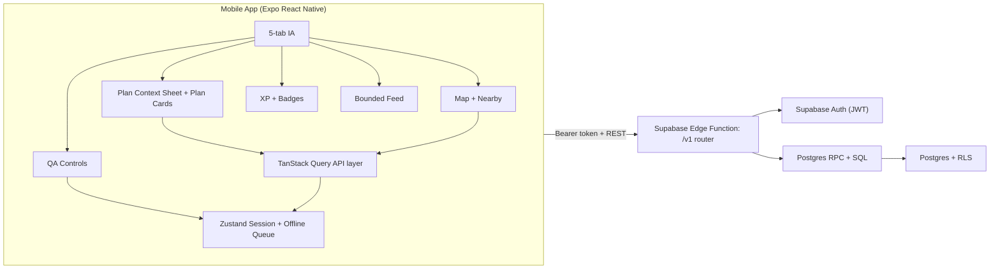
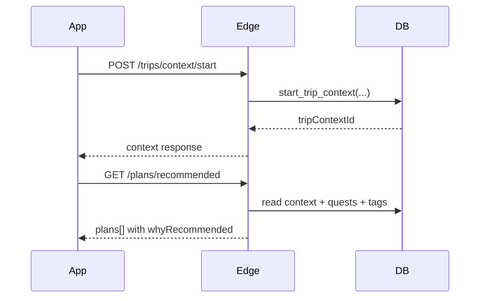
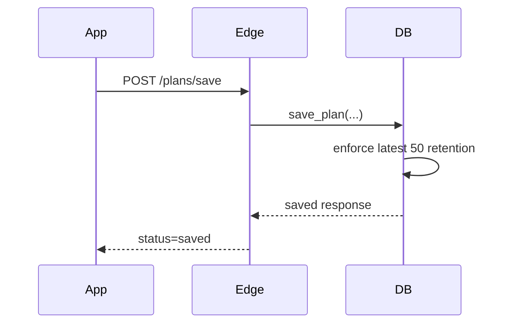

# Passport Quest Architecture (Phase A Plan-First V1)

Last updated: February 26, 2026  
Scope: Phase A (7-day) implementation, staging-first validation from Thaliparamba

## 1. Architecture intent

- Keep planning as the primary product loop: `Plan -> Start -> Complete -> Return`.
- Keep API/schema additive-only for MVP stability.
- Keep production UX Bangalore-first while allowing non-production QA city override.
- Keep recommendation logic explainable and deterministic (rule-based bundle engine).

## 2. High-level system design

```mermaid
flowchart LR
  subgraph Mobile["Mobile App (Expo React Native)"]
    Tabs["5-tab IA"]
    Plan["Plan Context Sheet + Plan Cards"]
    Explore["Map + Nearby"]
    Progress["XP + Badges"]
    Social["Bounded Feed"]
    Profile["QA Controls"]
    State["Zustand Session + Offline Queue"]
    Query["TanStack Query API layer"]
    Tabs --> Plan
    Tabs --> Explore
    Tabs --> Progress
    Tabs --> Social
    Tabs --> Profile
    Plan --> Query
    Explore --> Query
    Profile --> State
    Query --> State
  end

  Mobile -->|"Bearer token + REST"| Edge["Supabase Edge Function: /v1 router"]
  Edge --> Auth["Supabase Auth (JWT)"]
  Edge --> DBRPC["Postgres RPC + SQL"]
  DBRPC --> DB["Postgres + RLS"]
```

## 3. Repository mapping

- `/Users/atulkrishnan/Documents/Passport Quest/apps/mobile`: tabs, plan UX, profile QA controls, API client.
- `/Users/atulkrishnan/Documents/Passport Quest/packages/shared`: request/response contracts and shared types.
- `/Users/atulkrishnan/Documents/Passport Quest/supabase/functions/v1`: API routing, recommendation bundle assembly.
- `/Users/atulkrishnan/Documents/Passport Quest/supabase/migrations`: schema, RLS, RPC functions.
- `/Users/atulkrishnan/Documents/Passport Quest/docs`: architecture, QA checklist, UAT evidence.

## 4. Mobile architecture

### 4.1 Information architecture (cutover completed)

- `Plan`: `/Users/atulkrishnan/Documents/Passport Quest/apps/mobile/app/(tabs)/index.tsx`
- `Explore`: `/Users/atulkrishnan/Documents/Passport Quest/apps/mobile/app/(tabs)/explore.tsx`
- `Progress`: `/Users/atulkrishnan/Documents/Passport Quest/apps/mobile/app/(tabs)/progress.tsx`
- `Social`: `/Users/atulkrishnan/Documents/Passport Quest/apps/mobile/app/(tabs)/social.tsx`
- `Profile`: `/Users/atulkrishnan/Documents/Passport Quest/apps/mobile/app/(tabs)/profile.tsx`
- Experience detail: `/Users/atulkrishnan/Documents/Passport Quest/apps/mobile/app/quest/[questId].tsx`

### 4.2 Plan-first components

- `PlanContextSheet`: captures context type, time budget, budget, pace, vibe tags.
- `PlanCard`: renders bundle, explainability reasons, Start/Save/Share actions.
- `ReasonList`: reused explainability block on plan cards and detail surface.

### 4.3 City behavior

- Production: city selector hidden, Bangalore remains default UX.
- Non-production: QA-only city switcher is exposed in Profile QA section.
- Runtime city comes from session state (`activeCityId`) and is used across bootstrap and plan APIs.

## 5. Backend architecture

### 5.1 New Phase A API routes

- `POST /v1/trips/context/start`
- `PATCH /v1/trips/context/{tripContextId}`
- `POST /v1/trips/context/{tripContextId}/end`
- `GET /v1/plans/recommended?cityId={cityId}&tripContextId={tripContextId}&limit={n}`
- `GET /v1/quests/recommended?cityId={cityId}&tripContextId={tripContextId}&limit={n}` (compat alias)
- `POST /v1/recommendations/feedback`
- `POST /v1/plans/save`
- `GET /v1/plans/saved?limit={n}&cursor={cursor}`
- `DELETE /v1/plans/saved/{planId}`

Existing V1 routes remain additive and backward compatible.

### 5.2 Recommendation engine shape

- Input: trip context + city + active quests + quest experience tags.
- Candidate scoring: context fit, vibe overlap, budget/pace heuristics.
- Output: plan bundles with explainability (`whyRecommended[]`) and ordered stops.
- Fallback: no hard error on low candidate pool; still returns usable plan output.

### 5.3 New database objects

- `trip_context_sessions`
- `quest_experience_tags`
- `recommendation_feedback`
- `saved_plans`

Key constraints:

- `saved_plans` uniqueness: `(user_id, plan_id)`.
- Retention enforced at save-time: keep latest 50 plans/user.
- All new tables have RLS enabled.

## 6. Runtime flows

### 6.1 Plan generation flow

```mermaid
sequenceDiagram
  participant App
  participant Edge
  participant DB

  App->>Edge: POST /trips/context/start
  Edge->>DB: start_trip_context(...)
  DB-->>Edge: tripContextId
  Edge-->>App: context response
  App->>Edge: GET /plans/recommended
  Edge->>DB: read context + quests + tags
  Edge-->>App: plans[] with whyRecommended
```

### 6.2 Save plan flow

```mermaid
sequenceDiagram
  participant App
  participant Edge
  participant DB

  App->>Edge: POST /plans/save
  Edge->>DB: save_plan(...)
  DB->>DB: enforce latest 50 retention
  DB-->>Edge: saved response
  Edge-->>App: status=saved
```

## 7. Analytics and quality gates

Tracked events include:

- `trip_context_started`
- `trip_context_updated`
- `trip_context_ended`
- `recommended_quest_impression`
- `recommended_quest_opened`
- `recommended_quest_started`
- `recommended_quest_completed`
- `recommendation_feedback_submitted`

Release gates:

- `npm run mobile:typecheck`
- `npm run mobile:test`
- `npm run supabase:test`
- `npm run contracts:smoke`

## 8. Guardrails

- API/schema remain additive-only for MVP.
- Plan-first feature is governed by `planV1Enabled` runtime flag.
- No Bangalore hardcoding in shared UI logic beyond production UX defaults.
