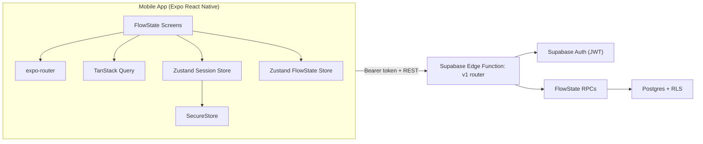

# FlowState Architecture (Living Document)

Last updated: February 27, 2026  
Scope: Decision-first execution assistant (FlowState v1)

## 1. Architecture goals

- Minimize planning UI and maximize execution velocity.
- Keep decision and reward logic server-trusted.
- Keep city handling data-driven and city-agnostic.
- Keep mobile runtime resilient on unstable networks.

## 2. High-level design

```mermaid
flowchart LR
  subgraph Mobile["Mobile App (Expo React Native)"]
    UI["FlowState Screens"]
    Router["expo-router"]
    Query["TanStack Query"]
    Session["Zustand Session Store"]
    FlowStore["Zustand FlowState Store"]
    Secure["SecureStore"]
    UI --> Router
    UI --> Query
    UI --> Session
    UI --> FlowStore
    Session --> Secure
  end

  Mobile -->|"Bearer token + REST"| Edge["Supabase Edge Function: v1 router"]
  Edge --> Auth["Supabase Auth (JWT)"]
  Edge --> RPC["FlowState RPCs"]
  RPC --> DB["Postgres + RLS"]
```

## 3. Repository map

- `/Users/atulkrishnan/Documents/Passport Quest/apps/mobile`
- `/Users/atulkrishnan/Documents/Passport Quest/packages/shared`
- `/Users/atulkrishnan/Documents/Passport Quest/supabase/functions/v1`
- `/Users/atulkrishnan/Documents/Passport Quest/supabase/migrations`
- `/Users/atulkrishnan/Documents/Passport Quest/docs`

## 4. Mobile architecture

### 4.1 Route surface

- `app/onboarding.tsx`: life diagnostic onboarding.
- `app/(tabs)/index.tsx`: instant hero play.
- `app/play/[id].tsx`: active execution script.
- `app/(tabs)/profile.tsx`: achievement loop.

### 4.2 State model

- `session` store:
  - auth tokens
  - user id
  - active city id
  - onboarding state
- `flowstate` store:
  - diagnostic draft + completion state
  - hero play payload
  - active play session + timer state
  - live metrics (xp, plays completed, decisions saved, planning minutes saved)

### 4.3 UI system

- Shared components include:
  - `GlassCard`
  - `NeonButton`
  - `XPBar`
  - `StatTile`
  - `ScreenContainer`

## 5. Backend architecture

### 5.1 Edge routes (current)

- `POST /v1/flowstate/diagnostic`
- `GET /v1/flowstate/play/hero`
- `POST /v1/flowstate/play/start`
- `GET /v1/flowstate/play/sessions/{sessionId}`
- `POST /v1/flowstate/play/sessions/{sessionId}/steps/{stepOrder}/done`
- `GET /v1/flowstate/summary`
- `GET /v1/config/bootstrap`
- `GET /v1/users/me/summary`
- `PATCH /v1/users/me/profile`
- `POST /v1/notifications/register-token`
- `GET /v1/health`

### 5.2 Core RPCs

- `upsert_user_flow_diagnostic`
- `get_hero_play`
- `start_play_session`
- `get_play_session_detail`
- `mark_play_step_done`
- `get_flowstate_summary`
- bootstrap/profile/runtime support RPCs

## 6. Data domains

### Core runtime

- `cities`
- `city_runtime_config`
- `profiles`
- `user_stats`
- `user_push_tokens`
- `user_experiments`
- `api_request_metrics`

### FlowState domain

- `user_flow_diagnostics`
- `play_templates`
- `play_template_steps`
- `play_recommendations`
- `play_sessions`
- `play_session_steps`

## 7. Key runtime flows

### 7.1 Bootstrap

1. Session bootstrap (anonymous or guest credential fallback).
2. Fetch bootstrap config + user summary.
3. Decide onboarding vs home route from diagnostic completion.

### 7.2 Diagnostic -> hero play

1. Submit diagnostic payload.
2. Fetch one hero play recommendation.
3. Persist to FlowState store and render single execution CTA.

### 7.3 Execution script

1. Start session from recommendation id.
2. Render active step and countdown.
3. Mark steps done sequentially.
4. Apply reward payload and updated metrics.

## 8. Reliability and governance

- API and schema changes should be additive within major version.
- City-specific behavior must remain config/RPC-driven.
- Every route response includes `x-request-id` and `x-release-sha`.
- Maintain SQL tests for FlowState RPC contracts on each migration update.
